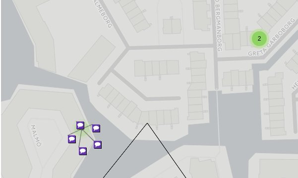

# Vega

Hieronder antwoorden op vragen van Richard en verder nog wat opmerkingen over dingen die ik tegengekomen ben tijdens het experimenteren met Vega.

## Webfonts

Webfonts kun je gebruiken in een Vega spec. Het is ook mogelijk om met css de styling van een Vega spec aan te passen, maar dat kan alleen nadat de spec gerenderd is en als de svg renderer gebruikt wordt. Zie dit [testje](http://abumarkub.net/fffact/webfonts-css).

## Labels bij de assen van een grafiek

Alles wat met svg kan is mogelijk.

## Animaties

Animaties zijn (nog) niet ingebouwd in Vega3. In Vega2 zijn animaties wel (beperkt) mogelijk. Zie de [porting guide](https://vega.github.io/vega/docs/porting-guide/#animation).

## Kaarten

Tile maps worden niet ondersteund, zie dit [issue](https://github.com/vega/vega/issues/899) op Github. In datzelfde issue wordt [leaflet-vega](https://github.com/nyurik/leaflet-vega) aangeraden. Deze library maakt van de Vega spec een layer in Leaflet. Dat werkt op zich goed maar niet alle functionaliteit van Leaflet is beschikbaar in de Vega layer, die moet nagemaakt worden in Vega,  bijvoorbeeld:

- Fit to bounds: heel handig om bijvoorbeeld in te zoomen op een bepaalde geografische entiteit (e. g. een buurt in Schiedam).

- Marker cluster: op basis van zoom nivo worden markers geclusterd en verschijnt er een bolletje met het aantal markers in dat cluster. Als je op een cluster klikt zie je de afzonderlijke markers (zie plaatje hieronder).

## Tooltips

In een Vega spec kun je standaard html tooltips gebruiken die mouseover verschijnen als je het `title` attribuut een van een html tag een waarde geeft. De opmaak hiervan is systeem-specifiek en kan niet aangepast worden.

In de officiële Vega repository op Github staat de [vega-tooltip](https://github.com/vega/vega-tooltip) plugin. Deze plugin wordt in de javascript runtime aan een Vega view gekoppeld en is dus *geen* onderdeel van de spec.

De plugin werkt niet samen met leaflet-vega:

- [test met leaflet en native tooltips](http://abumarkub.net/fffact/2)
- [test met de tooltip plugin](http://abumarkub.net/fffact/2a)

